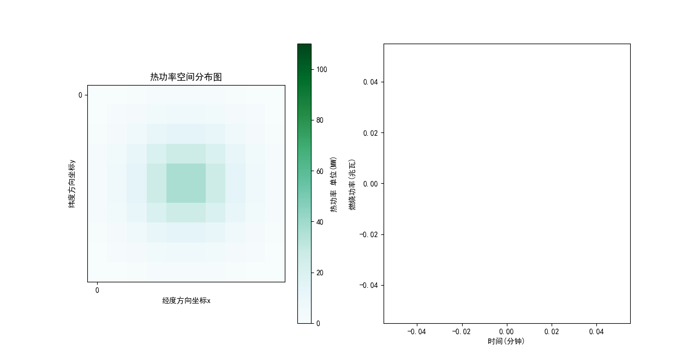

# EmergencyDeductionEngine
This is an Emergency Deduction Engine  

 
**Figure 1** Evolution of six weather conditions (Visibility, brightness, temperature, wind-speed, wind-direction, and rain-fall)
 
**Figure 2** Evolution of base hazard in temporal
 
**Figure 3** Evolution of base hazard in spatial